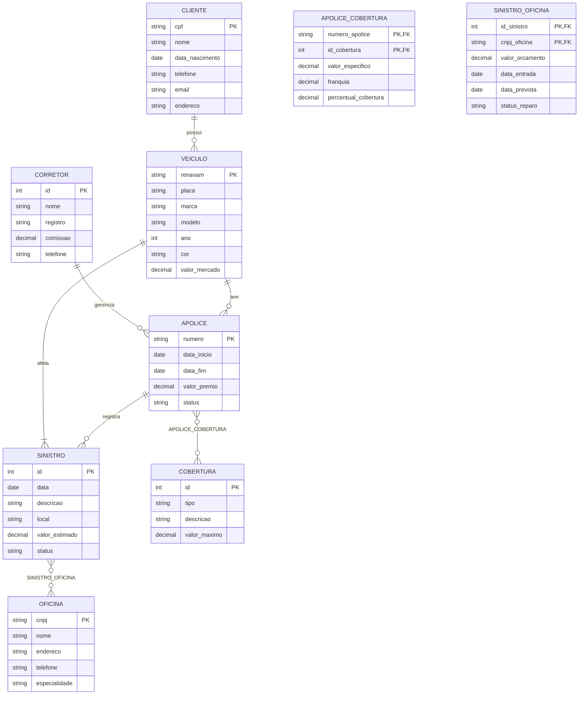

Sistema de Seguros de Veículos

```mermaid
erDiagram
    CLIENTE ||--o{ VEICULO : possui
    CLIENTE {
        string cpf PK
        string nome
        date data_nascimento
        string telefone
        string email
        string endereco
    }
    
    VEICULO ||--o{ APOLICE : tem
    VEICULO {
        string renavam PK
        string placa
        string marca
        string modelo
        int ano
        string cor
        decimal valor_mercado
    }
    
    CORRETOR ||--o{ APOLICE : gerencia
    CORRETOR {
        int id PK
        string nome
        string registro
        decimal comissao
        string telefone
    }
    
    APOLICE ||--o{ SINISTRO : registra
    APOLICE {
        string numero PK
        date data_inicio
        date data_fim
        decimal valor_premio
        string status
    }
    
    SINISTRO }|--|| VEICULO : afeta
    SINISTRO {
        int id PK
        date data
        string descricao
        string local
        decimal valor_estimado
        string status
    }
    
    COBERTURA {
        int id PK
        string tipo
        string descricao
        decimal valor_maximo
    }
    
    OFICINA {
        string cnpj PK
        string nome
        string endereco
        string telefone
        string especialidade
    }
    
    APOLICE }o--o{ COBERTURA : APOLICE_COBERTURA
    APOLICE_COBERTURA {
        string numero_apolice PK,FK
        int id_cobertura PK,FK
        decimal valor_especifico
        decimal franquia
        decimal percentual_cobertura
    }
    
    SINISTRO }o--o{ OFICINA : SINISTRO_OFICINA
    SINISTRO_OFICINA {
        int id_sinistro PK,FK
        string cnpj_oficina PK,FK
        decimal valor_orcamento
        date data_entrada
        date data_prevista
        string status_reparo
    }

```
