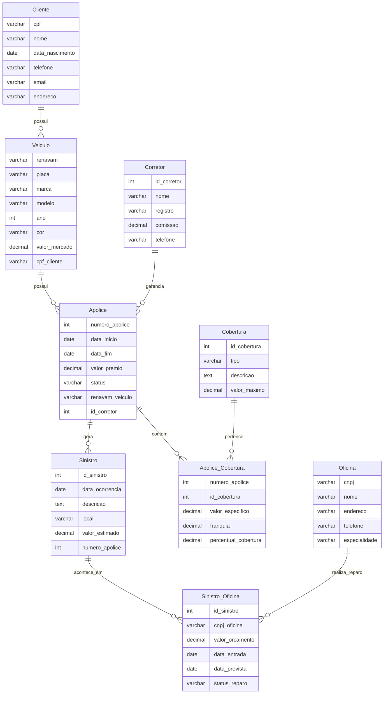

#### Isabella Benevenuto RA: 22.123.007-1
#### Mateus Marana       RA: 22.123.026-1
---

# 🏛️ Projeto: Sistema de Seguros de Veículos

Este projeto simula o ambiente de uma seguradora de veículos por meio de um banco de dados relacional completo. Ele foi desenvolvido com o objetivo de apoiar atividades de ensino e prática em:

- 📐 Modelagem de dados (MER e DDL)
- 🧬 Geração de dados fictícios com Python
- ✅ Validação de integridade e consistência dos dados
- 🔍 Execução e testes de queries SQL com Supabase (PostgreSQL) ou MySQL

A base contempla os principais elementos de um sistema de seguros de veículos:

- *Clientes*
- *Veículos*
- *Corretores*
- *Apólices de seguro*
- *Coberturas*
- *Sinistros*
- *Oficinas de reparo*

Todos os relacionamentos foram modelados de forma a refletir situações reais de uma seguradora, incluindo o controle de coberturas contratadas, acompanhamento de sinistros e gerenciamento financeiro de apólices.

---


---

## 🗂️ Estrutura do Projeto

```bash
/
├── data/
│   ├── clientes.csv
│   ├── corretores.csv
│   ├── veiculos.csv
│   ├── apolices.csv
│   ├── coberturas.csv
│   ├── oficinas.csv
│   ├── sinistros.csv
│   ├── apolice_cobertura.csv
│   └── sinistro_oficina.csv
│
├── first_task.py         # Geração de dados fictícios
├── second_task.py        # Validação de dados gerados
├── third_task.py         # Geração de comandos SQL e inserção no Supabase
├── insert_data.sql       # Arquivo SQL gerado para inserção de dados
├── README.md             # (este arquivo)
└── requirements.txt      # (bibliotecas necessárias)
```

---

## ⚙️ Como Executar o Projeto

### 1. Preparação do ambiente

Clone o repositório e instale as dependências:

```bash
pip install -r requirements.txt
```

O arquivo `requirements.txt` deve conter:

```
pandas
supabase
```
